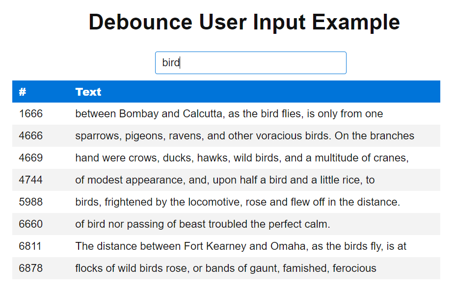

# RxJS pattern - Debounce User Input

Debounce User Input is a sandbox project to illustrate a RxJS pattern to delay user inputs
submission to avoid unnecessary processing.

## Screenshot


## Install & Running the applicaiton
* `npm install`
* `npm run server` to start server available at http://localhost:8080
* `npm start` to start frontend available at http://localhost:4200
* open http://localhost:4200 in a browser

## RxJS code snippet

see [GitHub repo](https://github.com/morarupasukaru/devdocs/blob/main/sandbox/rxjs-debounce-user-input/src/app/app.component.ts#L26-L37):
```javascript
...
const searchLines$ = fromEvent<KeyboardEvent>(this.input.nativeElement, 'keyup')
  .pipe(
    // get input value from event
    map((event: KeyboardEvent) => (event.target as HTMLInputElement).value),
    // delays the emissions of the source observable 'key event' of 400ms
    debounceTime(400),
    // returns an observable that emits all items emitted by the source observable that are distinct
    // by comparison from the previous item
    distinctUntilChanged(),
    // maps each value from source to an observable and flattens all of these inner observables using 
    // switchAll (stop emmiting last observable before emitting a new one)
    switchMap(search => this.loadLines(search))
  );
...
```

## Credits

* RxJS debounce user input solution took from [RxJs 6 In Practice](https://www.udemy.com/course/rxjs-course/) Udemy course from [Angular University](https://angular-university.io/)
* CSS Library: https://picnicss.com/
* ['Around the World in Eighty Days' by Jules Verne](https://www.gutenberg.org/ebooks/103) took from https://www.gutenberg.org/

*(Project mainly written in mai 2021)*

[*Go to parent page*](../README.md)
