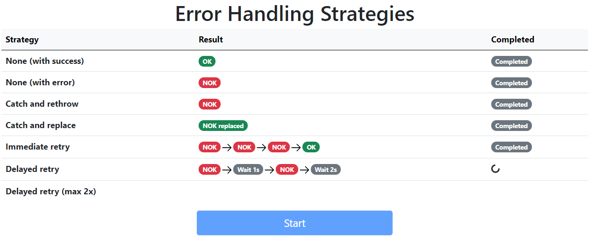

# RxJS - Error Handling strategies

Error Handling strategies show in actions different ways to handle error with RxJS.

  
## Screenshot



## Install & Running the applicaiton
* `npm install`
* `npm run server` to start server available at http://localhost:8080
* `npm start` to start frontend available at http://localhost:4200
* open http://localhost:4200 in a browser


## RxJS code snippet

Error handling strategies:
* [catch and rethrow](https://github.com/morarupasukaru/devdocs/blob/main/sandbox/rxjs-error-handling/src/app/error-handling-strategy.service.ts#L28)
```javascript
const source$ = this.http.get('...');
return source$.pipe(
  catchError(
    error => {
      return throwError(error);
    }
  )
);
```
* [catch and replace](https://github.com/morarupasukaru/devdocs/blob/main/sandbox/rxjs-error-handling/src/app/error-handling-strategy.service.ts#L40)
```javascript
const source$ = this.http.get('...');
return source$.pipe(
  catchError(
    error => {
      return of(`${error.error} replaced`);
    }
  )
);
```
* [immediate retry](https://github.com/morarupasukaru/devdocs/blob/main/sandbox/rxjs-error-handling/src/app/error-handling-strategy.service.ts#L52)
```javascript
const source$ = this.http.get('...');
const immediateRetry$ = source$.pipe(
  retryWhen(errors => errors)
);
```
* [delayed retry](https://github.com/morarupasukaru/devdocs/blob/main/sandbox/rxjs-error-handling/src/app/error-handling-strategy.service.ts#L74)
```javascript
const source$ = this.http.get('...');
const delayedRetry$ = source$.pipe(
  retryWhen(
    errors => errors.pipe(
      delayWhen((_, i) => {
        const waitS = i + 1;
        return timer(waitS * 1000);
      })
    )
  )
);
```
* [delayed retry (max retry)](https://github.com/morarupasukaru/devdocs/blob/main/sandbox/rxjs-error-handling/src/app/error-handling-strategy.service.ts#L111)
```javascript
const source$ = this.http.get('...');
const scalingDuration = 1000;
const maxRetries = 2;
const delayedRetry$ = source$.pipe(
  retryWhen(errors => errors.pipe(
    mergeMap((error, i) => {
      const retryAttempt = i + 1;
      if (retryAttempt > maxRetries) {
        return throwError(error);
      }
      const waitMs = retryAttempt * scalingDuration;
      return timer(waitMs);
    })
  )),
  catchError(error => {
    return throwError(error);
  }));
```


## Credits

* most RxJS error handling strategies took from [RxJs 6 In Practice](https://www.udemy.com/course/rxjs-course/) Udemy course from [Angular University](https://angular-university.io/)
* delayed retry strategy took from: https://www.learnrxjs.io/learn-rxjs/operators/error_handling/retrywhen
* CSS Library: https://useiconic.com/open/
* [arrow icon](https://primer.style/octicons/arrow-right-16) from https://primer.style/octicons/
* [ulid](https://github.com/ulid/spec) as random id generator
*(Project mainly written in june 2021)*

[*Go to parent page*](../README.md)
