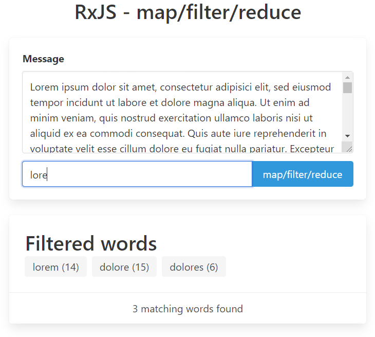

# RxJS pattern - map/filter/reduce

map/filter/reduce is a sandbox project to illustrate an example 
how to map/filter/reduce data with RxJS.

## Screenshot


## Install & Running the applicaiton
* `npm install`
* `npm start` to start frontend available at http://localhost:4200
* open http://localhost:4200 in a browser

## RxJS code snippet

Disclaimer:
* taken solution depends greatly on the expected result (specifications of the application) 
  and there is no general solution that could be copy-pasted
  
see [GitHub repo](https://github.com/morarupasukaru/devdocs/blob/main/sandbox/rxjs-map-filter-reduce/src/app/app.component.ts#L24-L38):
```javascript
...
const text$: Observable<string> = of(this.inputText);
this.output$ = text$.pipe(
  // split text into words
  concatMap(text => from(text.split(/\s+/))),
  map(word => word.toLowerCase()),
  // apply filters
  filter(word => word.length > 0),
  filter(word => !this.inputFilter || word.indexOf(this.inputFilter) !== -1),
  // data reduce by applying a groupBy operator to get distinct words along with word count
  groupBy(word => word),
  mergeMap(group$ => zip(of(group$.key), group$.pipe(count()))),
  map(group => group[0] + ' (' + group[1] + ')'),
  // to array applied when the source observable complete
  toArray()
);
...
```


## Credits

* CSS Library: https://bulma.io/
* "Lorem ipsum" text from: https://la.wikisource.org/wiki/Lorem_ipsum 

*(Project mainly written in mai 2021)*

[*Go to parent page*](../README.md)

