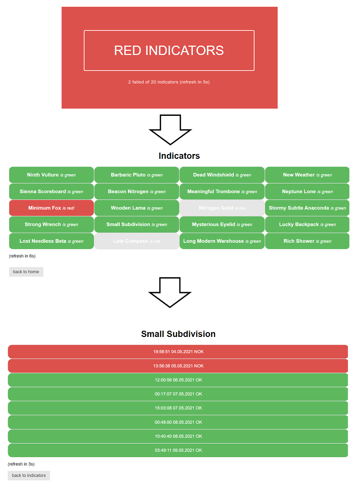

# RxJS patterns - Single data observable

Indicators is a sandbox project to illustrate
*single data observable* RxJS pattern to merge several observables into a single one to ease use
their uses in component's template by calling a unique async pipe.

## Screenshot

## Install & Running the applicaiton
* `npm install`
* `npm run server` to start server available at http://localhost:8080
* `npm start` to start frontend available at http://localhost:4200
* open http://localhost:4200 in a browser

## RxJS code snippet
*single data observable* RxJS pattern to merge several observables into a single one to ease use
their uses in component's template by calling a unique async pipe
 * see [root-indicator.component.ts](https://github.com/morarupasukaru/devdocs/blob/main/sandbox/rxjs-single-data-observable/src/app/components/root-indicator/root-indicator.component.ts#L34) for the creation of the single data observable
 * see [root-indicator.component.html](https://github.com/morarupasukaru/devdocs/blob/main/sandbox/rxjs-single-data-observable/src/app/components/root-indicator/root-indicator.component.html) for the use of the single data observable in an angular template with an unique async pipe

## Credits

* RxJS patterns took from [Reactive Angular Course (with RxJs)](https://www.udemy.com/course/rxjs-reactive-angular-course/) Udemy course from [Angular University](https://angular-university.io/)
* CSS Library and [landing page layout](https://github.com/pure-css/pure/tree/master/site/static/layouts/marketing): https://purecss.io/
* project names generated with https://online-generator.com/

*(Project mainly written in june 2021)*

[*Go to parent page*](../README.md)

