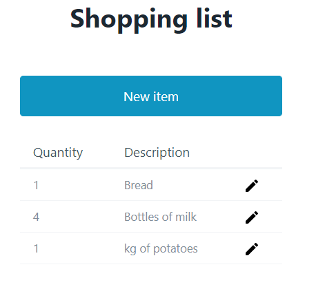

# RxJS patterns - Stateless Observable Service & Store Service

Shopping list is a sandbox project to illustrate
*stateless observable service* and *store servic* RxJS patterns that hide 
complexity betwen a simple API using Observables.

## Screenshot

## Install & Running the applicaiton
* `npm install`
* `npm run server` to start server available at http://localhost:8080
* `npm start` to start frontend available at http://localhost:4200
* open http://localhost:4200 in a browser

## RxJS code snippet

* *store service pattern* is a service hiding a state/data behind a simple API using
Observables; typically implemented with BehaviourSubject
  * see [edited-item-store.service.ts](https://github.com/morarupasukaru/devdocs/blob/main/sandbox/rxjs-stateless-observable-and-store-services/src/app/services/edited-item-store.service.ts)
* *stateless observable service* is a service providing API using Observables and that 
  does not persist any data (stateless)
  * see [items.service.ts](https://github.com/morarupasukaru/devdocs/blob/main/sandbox/rxjs-stateless-observable-and-store-services/src/app/services/items.service.ts)  

## Credits

* RxJS patterns took from [Reactive Angular Course (with RxJs)](https://www.udemy.com/course/rxjs-reactive-angular-course/) Udemy course from [Angular University](https://angular-university.io/)
* CSS Library: https://picocss.com/
* mode_edit icon from https://fonts.google.com/icons?selected=Material+Icons

*(Project mainly written in mai 2021)*

[*Go to parent page*](../README.md)
